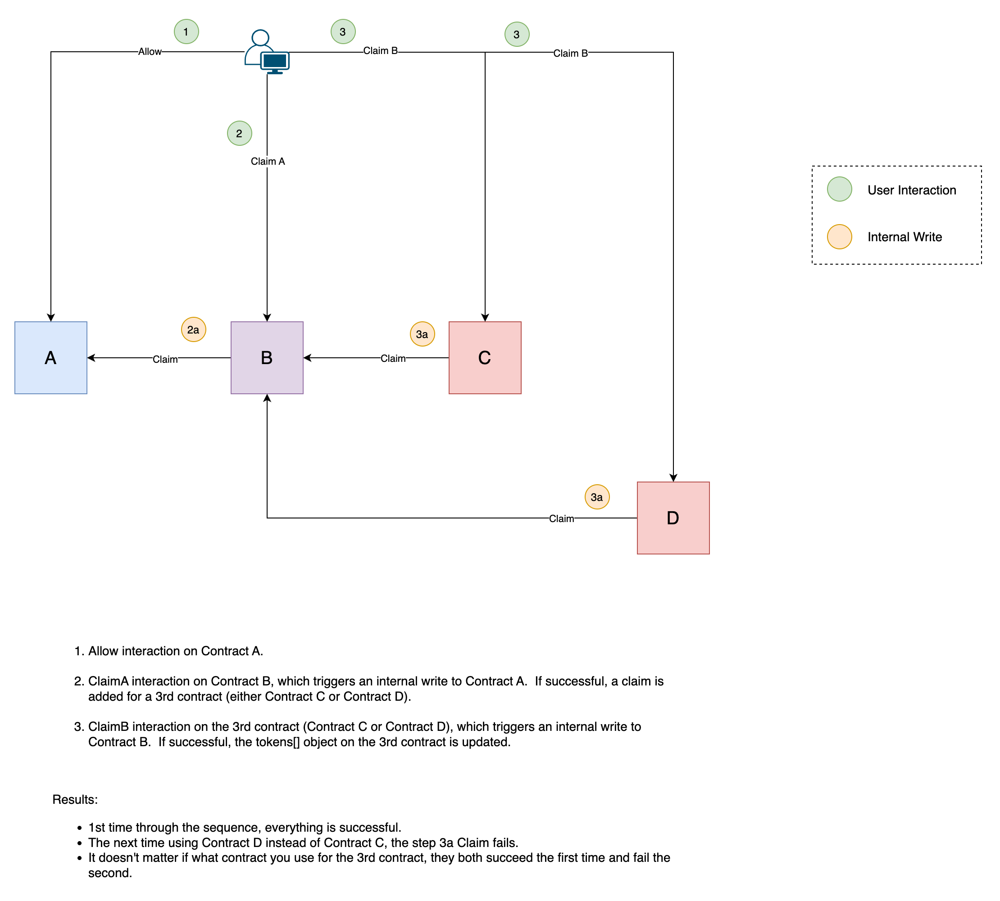

# sw-tests

SmartWeave Test Repo

```javascript
// Make sure arlocal is running
npx arlocal

// Run test script
npm run test
```

The 3 contracts in the test kickoff using FCP (allow/claim) on the first contract.  When the 2nd contract initiates the claim on the 1st contract, the 2nd contract, pushes a new claim for the 3rd contract to claim.  This sequence is succesful the first time, but when run again, with another contract performing the same steps, it fails.

So, the script is configured to run through the sequence first with Contracts A, B, and C.  Then, it runs through the sequence again with Contracts A, B, and D.  Contract D fails in step 3a during the 2nd run.  The script ends reading the states of Contract B, C, and D to show the differences.  Notice that Contract B shows that Contract D's claim processed successfully, but Contract D reports an error.

